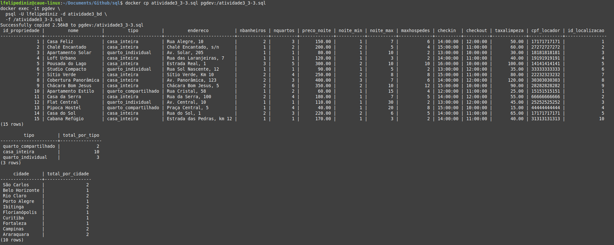
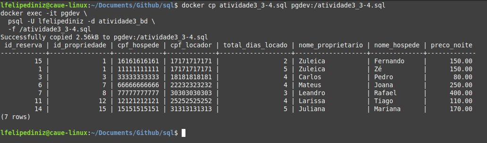
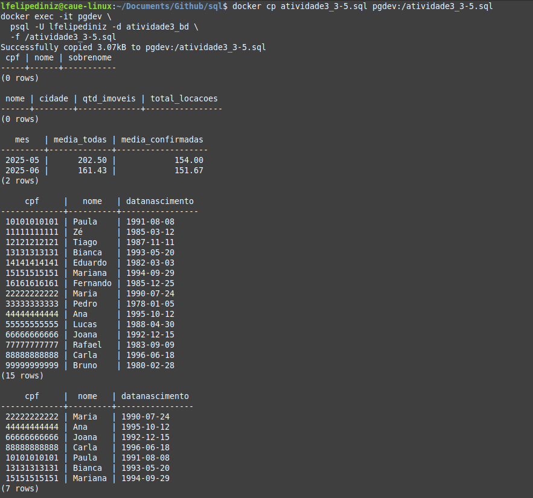

# RentalData

This project is a PostgreSQL-based implementation of a database model for an accommodation and reservation platform, following academic specifications.

It contains SQL scripts to create the schema, populate it with fictitious data, and run analytical queries. The scripts are executed inside a Docker PostgreSQL container.

## Table of Contents

1. [Structure](#structure)
2. [Requirements](#requirements)
3. [Installation](#installation)
4. [How to Run](#how-to-run)
5. [Important Notes](#important-notes)


## Structure

```bash
.
├── atividade3_3-1.sql            # creates the database and tables (no integrity constraints)
├── atividades-consultas/         # contains all query-related scripts
│   ├── atividade3_3-2.sql        # loads fictitious data (INSERTs)
│   ├── atividade3_3-3.sql        # basic queries on property data
│   ├── atividade3_3-4.sql        # reservation analysis
│   └── atividade3_3-5.sql        # advanced queries and analytics
├── consultas.sql                 # master script that runs all queries
└── saida_consultas.txt           # output of all queries (for report inclusion)
```


## Requirements

* Docker
* PostgreSQL Docker image (automatically pulled when running container)


## Installation

1. Start a PostgreSQL container (if not running):

```bash
docker run -d \
  --name pgdev \
  -e POSTGRES_USER=lfelipediniz \
  -e POSTGRES_PASSWORD=1234 \
  -e POSTGRES_DB=atividade3_bd \
  -p 5434:5432 \
  postgres:latest
```

2. Copy all files into the container:

```bash
docker cp . pgdev:/
```


## How to Run

### Step 1: Drop and recreate the database + create tables

```bash
docker exec -it pgdev \
  psql -U lfelipediniz -d postgres \
  -f /atividade3_3-1.sql
```

### Step 2: Execute all inserts and queries, saving output

```bash
docker exec -i pgdev \
  psql -U lfelipediniz -d atividade3_bd \
  -f /consultas.sql > saida_consultas.txt
```

After this, the file `saida_consultas.txt` will contain the full output of:

* Data insertion
* Basic and advanced queries


## Important Notes

* **If you run `consultas.sql` more than once**, it will insert the same data multiple times.
* That's because we **did not implement integrity constraints (e.g. PRIMARY KEY, UNIQUE)** in this version.
* This behavior was intentional, following the instructions to skip constraints in the initial modeling phase.

You can manually clean the base by re-running:

```bash
docker exec -it pgdev \
  psql -U lfelipediniz -d postgres \
  -f /atividade3_3-1.sql
```

# Explanation of Step 3.1 SQL Commands

## 1. Database Initialization
- **`DROP DATABASE IF EXISTS atividade3_bd;`**  
  Ensures any existing database named `atividade3_bd` is removed first, avoiding “already exists” errors when re-running the script.
- **`CREATE DATABASE atividade3_bd;`**  
  Creates a brand-new PostgreSQL database called `atividade3_bd`.
- **`\connect atividade3_bd`**  
  Switches the psql session into the newly created database so that all subsequent `CREATE TABLE` statements apply there.

## 2. Table Cleanup
- **`DROP TABLE IF EXISTS <table_name> CASCADE;`**  
  For each table, this command safely deletes the table if it exists. The `CASCADE` option also removes any dependent objects (like foreign-key relationships or views) to prevent drop errors.

## 3. Main Table Definitions
Each `CREATE TABLE` defines an entity’s columns and data types without enforcing keys:

- **String types**  
  - `VARCHAR(n)`: variable-length strings up to `n` characters (e.g., `VARCHAR(100)` for names).  
  - `TEXT`: unlimited-length text, used where size is unpredictable (e.g., addresses and messages).
- **Date/time types**  
  - `DATE`, `TIME`, `TIMESTAMP` store calendar dates, clock times, and full timestamps, respectively.
- **Numeric types**  
  - `INTEGER`: whole numbers.  
  - `NUMERIC(precision, scale)`: exact decimals (e.g., money values with two decimal places).
- **Other types**  
  - `CHAR(1)`: fixed-length one-character fields (e.g., gender code).  
  - `BOOLEAN`: true/false values.

_No primary keys or foreign keys are specified here, keeping the focus solely on table structure._

## 4. Auto-Increment with `SERIAL`
- Columns declared as `SERIAL` (e.g., `id_propriedade SERIAL`)  
  Automatically create an integer column that pulls its values from a hidden sequence, making it easy to generate unique identifiers without manually managing sequences.

## 5. Associative Tables for Many-to-Many
- Tables like `propriedade_comodidade` and `propriedade_regra`  
  Represent N:M relationships by listing pairs of referencing columns. They remain unconstrained in this version, simply holding the associations.

# Explanation of Step 3.2 SQL Data-Load Script

This section walks through each logical section of the `atividade3_3-2.sql` script, which populates the `atividade3_bd` database with sample data. No table definitions are repeated here—only the rationale behind each `INSERT`.


## 1) Inserting into `hospede`
- **Purpose:** Load 15 guest records to simulate real users.
- **Key Points:**  
  - Columns listed in the same order as the `CREATE TABLE` in Step 3.1.  
  - String literals in quotes match each `VARCHAR` or `TEXT` column.  
  - `NULL` used where optional information (phone or email) isn’t provided.  
  - Dates follow the `YYYY-MM-DD` format for the `DATE` type.  
  - Passwords are stored in plain text here for testing (in real systems, they’d be hashed).


## 2) Inserting into `locador`
- **Purpose:** Populate 15 property-owner records.
- **Key Points:**  
  - Structure parallels `hospede`: same columns, but for hosts instead of guests.  
  - Demonstrates handling of `NULL` and mixed-case strings.  
  - Ensures there are enough distinct `cpf` values to join later.


## 3) Inserting into `localizacao`
- **Purpose:** Define 15 distinct geographic locations.
- **Key Points:**  
  - Omits the `id_localizacao` column because it’s `SERIAL`; PostgreSQL auto-generates it.  
  - Mix of Brazilian cities spread across states, illustrating how to store address metadata.  
  - Postal codes (`cep`) and neighborhood names complete the location data.


## 4) Inserting into `comodidade`
- **Purpose:** Seed 15 amenity names for properties.
- **Key Points:**  
  - Only one column (`nome`) is listed in the `INSERT`.  
  - Multiple values in a single statement improve load performance.  
  - Shows how to bulk-insert simple lookup data.


## 5) Inserting into `regra`
- **Purpose:** Establish 10 distinct house rules, with a Boolean flag for allowance.
- **Key Points:**  
  - `tipo` describes the rule (e.g., “Fumar” or “Pets”).  
  - `permitido` uses `TRUE`/`FALSE` to indicate rule enforcement.  
  - This lookup table drives business logic in booking validations.


## 6) Inserting into `propriedade`
- **Purpose:** Create 15 property listings tied to hosts and locations.
- **Key Points:**  
  - Omits the `id_propriedade` column because it’s `SERIAL`; PostgreSQL auto-generates it.  
  - Times for `checkin`/`checkout` follow the `HH:MM` format for the `TIME` type.  
  - References to `cpf_locador` and `id_localizacao` demonstrate how foreign keys would connect tables.


## 7) Inserting into `quarto`
- **Purpose:** Define individual rooms within properties (weak entity).
- **Key Points:**  
  - Composite identifier: (`id_propriedade`, `numero`) together distinguish each room.  
  - Booleans (`banheiroprivativo`) use `TRUE`/`FALSE`.  
  - Illustrates one-to-many relationships without explicit constraints.


## 8) Inserting into `reserva`
- **Purpose:** Load 15 booking records to simulate reservations.
- **Key Points:**  
  - Dates (`datareserva`, `checkin`, `checkout`) in `YYYY-MM-DD`.  
  - Monetary fields (`imposto`, `precototal`, `precocomtaxa`) use `NUMERIC(10,2)`.  
  - `status` is a text flag (e.g., `confirmada`, `pendente`, `cancelada`).  
  - References `id_propriedade` and `cpf_hospede` tie each booking to a guest and property.


*Each `INSERT` follows the pattern: list the target columns, then provide matching values for each row.  This ensures data integrity and clarity when reviewing or extending the dataset.*

# Explanation of Step 3.3 SQL Queries

This section demonstrates three basic queries on the populated tables: retrieving all rows, aggregating by property type, and counting by city through a join.

## 3.3 Result



## 1) Retrieve All Records from `propriedade`

```sql
SELECT *
FROM propriedade;
````

* **`SELECT *`**
  Fetches every column from the `propriedade` table.
* **`FROM propriedade`**
  Indicates the source table.
* **Use Case:**
  Quickly inspect all properties, including auto-generated IDs, names, types, locations, pricing, and host references—ideal for a full data dump or debugging.


## 2) Count Properties by Type

```sql
SELECT tipo,
       COUNT(*) AS total_por_tipo
FROM propriedade
GROUP BY tipo;
```

* **`SELECT tipo`**
  Chooses the `tipo` column, which categorizes property (e.g., `casa_inteira`, `quarto_individual`).
* **`COUNT(*)`**
  Counts all rows in each group.
* **`AS total_por_tipo`**
  Renames the count column for clarity.
* **`GROUP BY tipo`**
  Aggregates rows sharing the same `tipo` value.
* **Use Case:**
  Understand distribution of listings by category, useful for analytics and reporting.


## 3) Count Properties per City via JOIN

```sql
SELECT l.cidade,
       COUNT(*) AS total_por_cidade
FROM propriedade p
JOIN localizacao l
  ON p.id_localizacao = l.id_localizacao
GROUP BY l.cidade;
```

* **`JOIN localizacao l ON p.id_localizacao = l.id_localizacao`**
  Links each property (`p`) to its location (`l`) by matching `id_localizacao`.
* **`SELECT l.cidade`**
  Retrieves the city name from the `localizacao` table.
* **`COUNT(*) AS total_por_cidade`**
  Tallies the number of properties in each city, renaming for readability.
* **`GROUP BY l.cidade`**
  Groups results by city to produce one row per location.
* **Use Case:**
  Analyze geographic distribution of properties, essential for market insights and strategic planning.


# Explanation of Step 3.4 SQL Query

This query retrieves all confirmed reservations with check-in dates on or after April 24, 2025, and joins related tables to enrich each record with owner and guest names, stay duration, and nightly price.

## 3.4 Result


## 1) Filtering Criteria

```sql
WHERE r.status = 'confirmada'
  AND r.checkin >= '2025-04-24';
````

* **`r.status = 'confirmada'`**
  Selects only reservations whose status is “confirmed.”
* **`r.checkin >= '2025-04-24'`**
  Ensures the reservation’s check-in date is on or after April 24, 2025.
* **Date Format:**
  Uses the ISO `YYYY-MM-DD` format expected by PostgreSQL for `DATE` comparisons.


## 2) Core Columns Selected

```sql
r.id_reserva,
p.id_propriedade,
r.cpf_hospede,
p.cpf_locador
```

* **`r.id_reserva`**: Unique reservation identifier.
* **`p.id_propriedade`**: Identifier of the property being booked.
* **`r.cpf_hospede`**: CPF (ID) of the guest making the reservation.
* **`p.cpf_locador`**: CPF (ID) of the property owner.

These four attributes form the primary keys for tracking who booked which property.


## 3) Calculating Total Days Rented

```sql
(r.checkout - r.checkin) AS total_dias_locado,
```

* **Date Subtraction:**
  Subtracting two `DATE` values in PostgreSQL yields an integer: the number of days between them.
* **Alias `total_dias_locado`:**
  Renames the result for clarity, indicating the length of stay.


## 4) Joining Related Tables

```sql
FROM reserva r
JOIN propriedade p ON r.id_propriedade = p.id_propriedade
JOIN locador loc ON p.cpf_locador   = loc.cpf
JOIN hospede hos ON r.cpf_hospede   = hos.cpf
```

* **`reserva r` → `propriedade p`**
  Links each reservation to its property record using `id_propriedade`.
* **`propriedade p` → `locador loc`**
  Retrieves the owner’s details by matching the property’s `cpf_locador` to the owner’s CPF.
* **`reserva r` → `hospede hos`**
  Retrieves the guest’s details by matching the reservation’s `cpf_hospede` to the guest’s CPF.

These joins enrich the reservation with both owner and guest information.


## 5) Retrieving Names and Price

```sql
loc.nome AS nome_proprietario,
hos.nome AS nome_hospede,
p.preco_noite
```

* **`loc.nome AS nome_proprietario`**
  Fetches the owner’s name from the `locador` table.
* **`hos.nome AS nome_hospede`**
  Fetches the guest’s name from the `hospede` table.
* **`p.preco_noite`**
  Retrieves the nightly rate from the `propriedade` table.

These columns deliver human-readable details and pricing for each confirmed booking.

# Explanation of Step 3.5 SQL Queries

This section analyzes five advanced queries that explore overlaps between guests and hosts, performance metrics for hosts, price trends, and age comparisons.

## 3.5 Result


## 1) Users Who Are Both Guests and Hosts

- **Logic:**  
  Find individuals whose CPF appears in both `hospede` and `locador`.
- **Technique:**  
  - **`JOIN` on identical CPF**: Matches rows where a guest’s `cpf` equals a host’s `cpf`, returning only those in both tables.
- **Use Case:**  
  Identify users who play dual roles—helpful for special treatment or auditing.


## 2) Hosts with at Least 5 Rentals

- **Logic:**  
  List each host’s name and city, count how many distinct properties they own, and total reservations across those properties, filtering to hosts with ≥ 5 bookings.
- **Techniques:**  
  - **Multiple `JOIN`s** to link `locador` → `propriedade` → `reserva` → `localizacao`.  
  - **`COUNT(DISTINCT p.id_propriedade)`**: Counts unique properties per host.  
  - **`COUNT(r.id_reserva)`**: Totals all reservations for those properties.  
  - **`GROUP BY l.cpf, l.nome, loc.cidade`**: Aggregates metrics per host and city.  
  - **`HAVING COUNT(r.id_reserva) >= 5`**: Filters groups to hosts meeting the threshold.
- **Use Case:**  
  Spotlight high-activity hosts for rewards or performance dashboards.


## 3) Average Nightly Rate per Month (All vs. Confirmed)

- **Logic:**  
  For each month, compute two averages of `preco_noite`: one over all reservations and one restricted to those confirmed.
- **Techniques:**  
  - **`TO_CHAR(r.checkin, 'YYYY-MM') AS mes`**: Formats the `checkin` date into a “year-month” string for grouping.  
  - **`AVG(p.preco_noite)`**: Calculates the overall average rate.  
  - **`AVG(CASE WHEN r.status = 'confirmada' THEN p.preco_noite END)`**: Uses a conditional expression inside `AVG` to include only confirmed bookings (NULLs ignored).  
  - **`ROUND(..., 2)`**: Rounds each average to two decimal places.  
  - **`GROUP BY mes`** and **`ORDER BY mes`**: Ensures chronological results.
- **Use Case:**  
  Track pricing trends and compare actual confirmed revenue vs. list rates.


## 4) Guests Younger Than Some Host

- **Logic:**  
  Return any guest whose birth date is later (i.e., younger) than at least one host’s birth date.
- **Techniques:**  
  - **`WHERE EXISTS (SELECT 1 FROM locador l WHERE h.datanascimento > l.datanascimento)`**:  
    For each guest `h`, the subquery checks if there is at least one host `l` born before them.
- **Use Case:**  
  Profile the demographic overlap where guests outnumber older hosts.


## 5) Guests Younger Than All Hosts

- **Logic:**  
  Find guests younger than every host in the system.
- **Techniques:**  
  - **`WHERE h.datanascimento > ALL (SELECT l.datanascimento FROM locador l)`**:  
    Compares each guest’s birth date against the entire set of host birth dates, returning only those strictly younger than the youngest host.
- **Use Case:**  
  Identify the youngest subset of guests relative to the entire host population.


*Each query demonstrates key SQL features—JOINs for combining tables, aggregate functions with GROUP BY/HAVING, date formatting, conditional aggregation, and subqueries using EXISTS/ALL—to answer complex business questions.*

---

## 📚 Academic Context

This repository was created for the **SCC0240 – Database Systems** course at USP.  
[Official course link](https://uspdigital.usp.br/jupiterweb/obterDisciplina?sgldis=SCC0240&codcur=55041&codhab=0)

